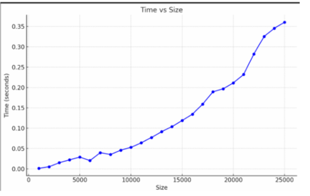
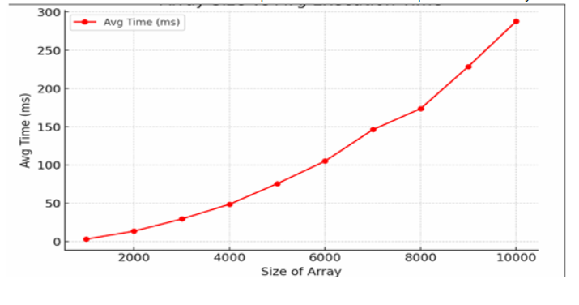
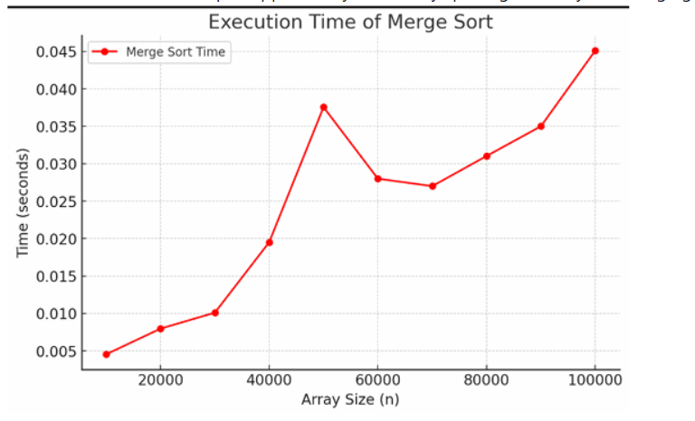
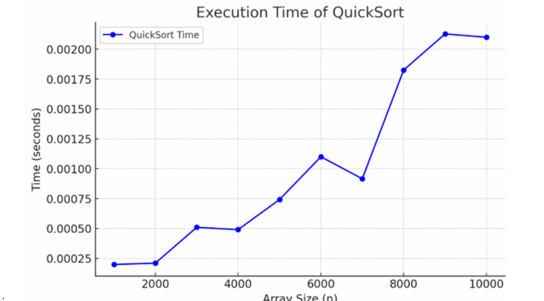

# Algorithms and Data Structures

This repository contains various implementations of algorithms and data structures in C++. Below is a list of available programs:
---
## Sorting Algorithms
Sorting algorithms are used to arrange elements in a specific order, typically ascending or descending. Different sorting techniques vary in terms of efficiency, stability, and space complexity.
| Sorting Algorithm        | Best Case | Average Case | Worst Case | Space Complexity | Stable? |
|-------------------------|------------|-------------|------------|-----------------|---------|
| *Selection Sort*      | O(n²)      | O(n²)       | O(n²)      | O(1)            |  No  |
| *Bubble Sort*         | O(n)       | O(n²)       | O(n²)      | O(1)            |  Yes |
| *Insertion Sort*      | O(n)       | O(n²)       | O(n²)      | O(1)            |  Yes |
| *Merge Sort*          | O(n log n) | O(n log n)  | O(n log n) | O(n)            |  Yes |
| *Quick Sort*          | O(n log n) | O(n log n)  | O(n²)      | O(log n)        |  No  |
| *Iterative Quick Sort*| O(n log n) | O(n log n)  | O(n²)      | O(log n)        |  No  |
- ### Selection Sort
 :Finds the minimum element and places it at the beginning, repeating the process for the rest of the list.
  
- ### Bubble Sort (bubblesort.cpp)
:Repeatedly swaps adjacent elements if they are in the wrong order.

- ### Insertion Sort (insertionsort.cpp)
:Inserts each element at the correct position in the sorted part of the array.

- ### Merge Sort
:  Uses the divide-and-conquer approach by recursively splitting the array and merging sorted halves.

 - ### Quick Sort
:Selects a pivot, partitions the array, and recursively sorts the partitions.

- *Iterative Quick Sort* (iterativequicksort.cpp)
:Implements quick sort iteratively using a stack instead of recursion.

  
---

##  Mathematical & Miscellaneous Algorithms
These algorithms solve various computational problems.

### 🔹 Find Peak Element in 1D & 2D Array
- Finding an element which is >= to its neighbours
- *1D*
Implemented using algo similar to Binary Search
- *2D*
Implemented using algo similar to Binary Search but works in a 2D array
- *Used in optimization problems* to find local maxima.
- Efficiently finds peaks in *logarithmic time*.

### 🔹 Magic Square (magicsquare.cpp)
- A square matrix where the sum of numbers in each row, column, and diagonal is the same.
- Follows a set pattern in where the numbers increase in a diagonal upwards to the left and goes down one when number is a multiple of the size
- *Used in cryptography and mathematical puzzles.*
  

##  Divide And Conquer Algorithms
These algorithms *break a problem into smaller subproblems, solve them recursively, and combine the results.*

### 🔹 Binary Search (binarysearch.cpp)
- Searches for an element in a sorted array in *O(log n) time*.
- *Much faster than linear search* for large datasets.

### 🔹 Max-Min Problem (maxmin.cpp)
- Finds the maximum and minimum in an array using *divide and conquer*.
- More efficient than brute force approaches.

### 🔹 Strassen's Matrix Multiplication
**Conventional Method
Using divide and conquer to break the matrix into smaller parts and multiplying them to get the resulting martix**
- Strassen's is  fast matrix multiplication algorithm.
- *Reduces multiplication complexity from O(n³) to O(n^2.81).*
---
## Greedy Algorithms
Greedy algorithms make locally optimal choices at each step *without considering future consequences*.

### 🔹 Activity Selection (activitysel.cpp)
- Selects the *maximum number of activities* that don’t overlap.
- *Used in scheduling problems.*

### 🔹 Knapsack Problem (knapsack.cpp)
- Optimizes item selection to *maximize value* within a weight constraint.
- We sort the array according to the metric we need(here we sort 3 time, according to profit, weight and ratio of profit/weight) and then pick the items in non-increasing manner
- The fractional part allows us to pick out items in fraction
For example if we have a capacity of 10 and the item weights 20 we can take out 10 out the weight instead of leaving that item and going to the next
- *Used in resource allocation problems.*

### 🔹 Dijkstra's Algorithm (dijkstra.cpp)
- Finds the *shortest path from a source node to all other nodes*.
- *Time Complexity: O(V²) (Using adjacency matrix) or O((V+E) log V) (Using priority queue + adjacency list).*
- *Used in network routing and GPS systems.*

### 🔹 Prim’s Algorithm
- Finds the *minimum spanning tree* of a graph.
- *Time Complexity: O(V²) (Using adjacency matrix) or O((V+E) log V) (Using priority queue + adjacency list).*
- *Used in network design problems.*

### 🔹 Kruskal’s Algorithm (kruskals.cpp)
- Another algorithm for finding the *minimum spanning tree*.
- *Time Complexity: O(E log E) (Using sorting and union-find data structure).*
- *Works well with edge list representation.*
---
##  Dynamic Programming (DP)
Dynamic Programming solves problems *by breaking them into overlapping subproblems and storing results*.

### 🔹 Multi-Stage Graph Problem (MGP.cpp)
- Solves shortest path problems in a multi-stage graph.
- *Time Complexity : O(V+E)*

### 🔹 All Pairs Shortest Path (Floyd-Warshall) (allPairdp.cpp)
- Finds *shortest paths between all pairs of nodes*.
- *O(n³) complexity, useful for dense graphs.*

### 🔹 0/1 Knapsack using Set (knapsack_set.cpp)
- Solves the *0/1 Knapsack problem* using a *set* to efficiently track possible states.
- *Improves over traditional DP* by reducing unnecessary state transitions.
- *Time Complexity: O(n × maxWeight)*
- *Space Complexity: Optimized using Set Data Structure.*
- *Used in optimization problems where space constraints are crucial.*
  

### 🔹 Travelling Salesman Problem (TSP) (tsp_dp.cpp)
- Solves the *TSP using Dynamic Programming and Bitmasking*.
- Finds the shortest possible route that visits each city exactly once and returns to the origin.
- *Time Complexity: O(n² × 2ⁿ)*
- *Space Complexity: O(n × 2ⁿ)*
- *Used in logistics, delivery services, and routing optimization.*

### 🔹 Matrix Chain Multiplication (matrixchain.cpp)
 - Finds the most efficient way to multiply a given sequence of matrices by selecting the best parenthesization.

 - *Problem*: Order of multiplication affects the total number of scalar multiplications.

- *Goal*: Minimize the total number of multiplications needed.

-*Approach*:

- Use a DP table where dp[i][j] represents the minimum number of multiplications needed to compute the matrix chain from matrix i to j.
- dp[i][j] = min(dp[i][k] + dp[k+1][j] + (cost of multiplying resulting matrices))  
- for all k between i and j
-*Time Complexity:* O(n³), where n is the number of matrices.

-*Space Complexity:* O(n²) (to store intermediate results).

-*Applications*:

- Used in database query optimization.

- Used in compiler design for code optimization.
> 

---
## Backtracking

Backtracking is a powerful algorithmic paradigm used to solve problems by exploring all possible solutions. It works by building solutions incrementally and abandoning a solution as soon as it is determined that it cannot be completed to a valid solution. This makes backtracking a more efficient way of solving problems than brute-force.

### Characteristics of Backtracking:
1. *Recursive Structure*: Backtracking problems are typically solved recursively.
2. *Pruning*: Infeasible solutions are discarded early, reducing the search space.
3. *Choice Tree*: Backtracking problems can be represented as a decision tree where each branch corresponds to a decision.

### Algorithms Using Backtracking

#### 1. *N-Queens Problem*
The N-Queens problem involves placing N queens on an N×N chessboard such that no two queens threaten each other. This problem is commonly solved using backtracking, where each queen is placed on the board one by one, and we backtrack when an invalid position is reached.

- *Time Complexity:* Worst-case time complexity for the backtracking solution is O(N!), where N is the number of queens (or the size of the chessboard).
- *Space Complexity:* The space complexity is O(N) because:
We need to maintain a list of size N to store the positions of the queens (in a 1D array or list, where each index represents a row and the value at the index represents the column of the queen).
Additionally, recursive calls will consume extra space on the call stack, which adds O(N) to the space complexity.

#### 2. *2. Graph Coloring Problem*
Graph Coloring is the process of assigning colors to the nodes of a graph such that no two adjacent nodes have the same color. This is a classic backtracking problem used to solve problems like scheduling and register allocation.
- *Time Complexity:* Worst-case time complexity for backtracking-based graph coloring is O(m^n), where:
n is the number of vertices in the graph.
m is the number of colors available.
This is because, in the worst case, for each vertex, you might try all m colors, and you have n vertices to color. Thus, the backtracking search explores all possible color assignments.
- *Space Complexity:* The space complexity is O(n) for storing the color assignments and the graph itself (if represented with an adjacency list or matrix). This includes:
  O(n) for storing the colors of the vertices.
  O(n + e) for storing the graph itself, where e is the number of edges.
  The call stack for the recursive backtracking algorithm also contributes to the space complexity, which would be O(n) in the worst case.
